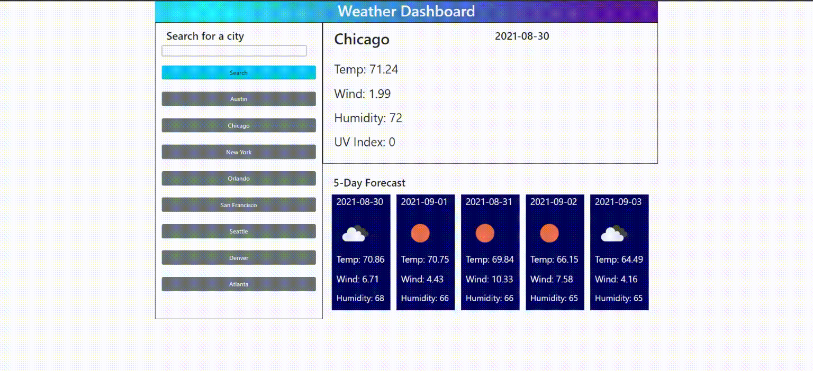

# weather-dashboard
This is a repository for a weather dashboard application

## DESCRIPTION
This application is a weather dashboard meant to provide users with current and forecast weather information about the city entered in the search-bar or select from one of the pre-determined options available on the screen by clicking on buttons. 

This solution allows users to easily check the current and forecast weather in many different cities.

Building this application provided a robust learning experience. I learned how to better utilize Bootstrap by practicing the use of the grid function, sizing of elements, breakpoints, margin and padding parameters, and setting colors inline. I also learned how to fetch API data with fetch(), how to json format the data, and how to extract data by DOM traversal, loops and conditional functions. I also learned how to parse 

## INSTALLATION
This is a web based application and as such requires no installation. Simply navigate to the URL for access.  

## USAGE
To use this application begin by navigating to https://oracle942.github.io/weather-dashboard/ 
Than simply enter a city in the search bar and press the search button, or select an option by clicking on one of the buttons listed in the left-hand side bar. 

## FEATURES
This application makes use of three APIs from Open Weather Map. All data displayed is provided by those three APIs. 

This application employs local storage to save the users last search. If the browser is closed, a the site is accessed from a new browser page the site displays the user’s last search results.  

Below is a list of features that are considered for future development:
•	Dynamically generated HTML elements with Javascript. 
•	Date generation using Moment.js
•	Round data to one decimal
•	Modify casing of dity name displayed when a search is performed using the search bar.

## NOTES

Some unexpected results occur when employing the APIs. Weather icons display without color only on occasion. Accurate UV Index readings sometimes require more than one button click.  

The date is programmed to display to the right of the city name displayed when a search is entered. The code runs locally but has failed in the github host. 